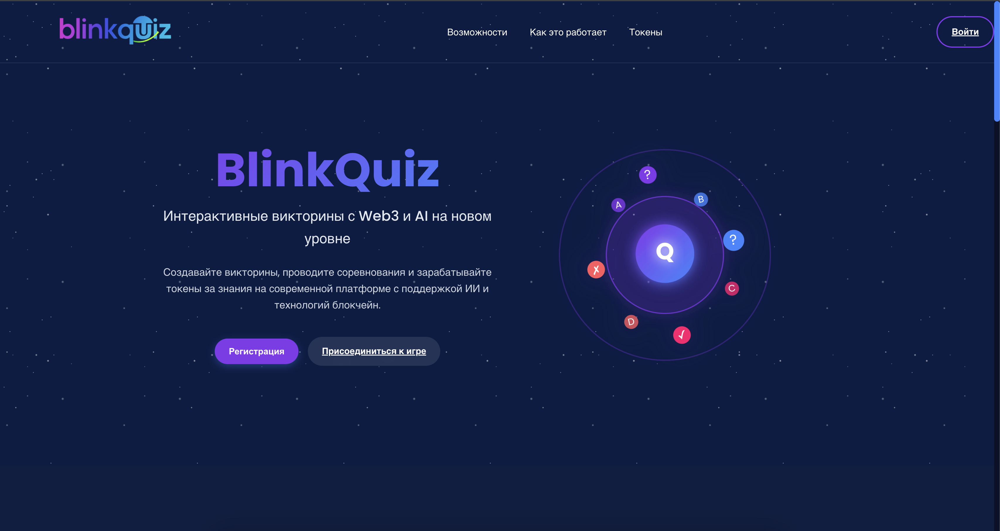

# BlinkQuiz 🚀

<div align="center">
  
<div align="center">
  
  </div>

### Инновационная Web3-Edutech платформа для интерактивного обучения
  
[](https://www.blinkquiz.space/)
[](https://github.com/IgorBlink/KuickHack2025/tree/frontend)
[](https://github.com/IgorBlink/KuickHack2025/tree/backend)

</div>

## 📚 О проекте

**BlinkQuiz** — это революционная Web3-Edutech платформа, объединяющая передовые технологии искусственного интеллекта, блокчейн и геймификацию для создания увлекательной образовательной среды.

### 🌟 Ключевые особенности

- **🤖 AI-генерация тестов** — мгновенное создание качественных тестов по любой теме или фотографии
- **⚡ Мгновенная обратная связь** — сразу узнавайте правильность ваших ответов и получайте объяснения
- **🎮 Геймификация** — системы достижений, рейтинги и соревнования делают обучение увлекательным
- **💰 Токеномика** — Web3-интеграция с токенами как вознаграждение за обучение и достижения
- **👥 Массовые викторины** — участвуйте в образовательных соревнованиях с тысячами пользователей

## 🚀 Начало работы

### Демо

Доступно онлайн-демо по ссылке: [https://www.blinkquiz.space/](https://www.blinkquiz.space/)

### Структура проекта

Проект разделен на две основные ветки:
- **[Frontend](https://github.com/IgorBlink/KuickHack2025/tree/frontend)** — клиентская часть приложения
- **[Backend](https://github.com/IgorBlink/KuickHack2025/tree/backend)** — серверная часть и API

## 💻 Технический стек

### Frontend
- ReactJS

- Web3 интеграция

### Backend
- Node.js
- Express
- MongoDB
- AI-интеграция (Gemini API)
- Blockchain технологии

## 📱 Скриншоты

<div align="center">
  
  <p><i>Пример интерфейса викторины с AI-генерацией</i></p>
</div>


---

<div align="center">
  <p>🔥 <b>BlinkQuiz</b> — Революция в образовании: быстро, интерактивно, с вознаграждением! 🔥</p>
</div>

## Usage

```bash
$ npm install
```

## Available Scripts

In the project directory, you can run:

### `VITE_USE_MOCK=true npm run dev`

Runs the app in the development mode.<br>
Opens [http://localhost:5173](http://localhost:5173) to view it in the browser.<br>
Primarily used for developing UI/UX.<br>
Uses mock requests

### `npm run debild`

Builds the app for dev to the `dist` folder.<br>
Uses .env.development file to load development-specific env variables.<br>
Skips authentication if it fails.<br>
Primarily used for developing UI/UX and testing server-client communication on a development URL.<br>

### `npm run build`

Builds the app for production to the `dist` folder.<br>
It uses .env.production file.<br>
